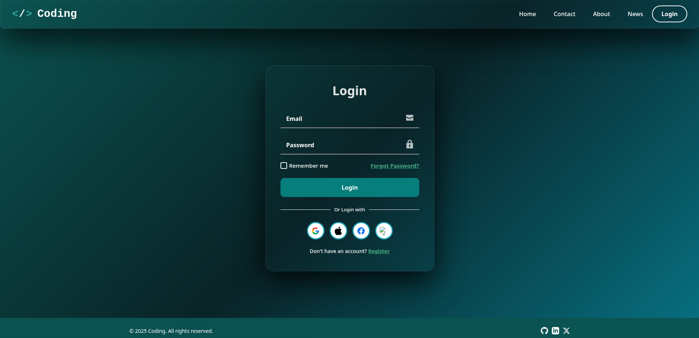
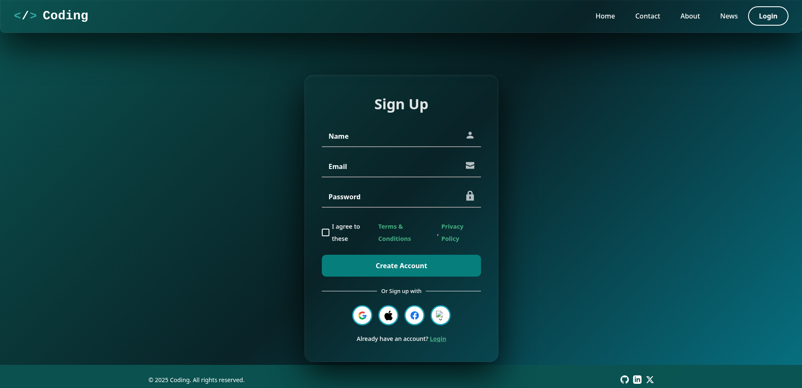

<p align="center">
  <a href="https://github.com/Dani-Devlop/Login-Page">
    
  </a>
  <a href="https://github.com/Dani-Devlop/Login-Page/blob/main/LICENSE">
    
  </a>
  <a href="#">
    
  </a>
  <a href="#">
    
  </a>
  <a href="#">
    
  </a>
  <a href="#">
    
  </a>
</p>

---

## 🖼️ Preview

<p align="center">
  
  
</p>
---

# 🔐 Login Page – Responsive Flip Card UI

A modern, fully responsive login and sign‑up page built with **HTML**, **CSS**, and **JavaScript**.  
This project features a **3D flip card** animation that smoothly transitions between the login and registration forms, delivering a sleek and interactive user experience.

---

## ✨ Features

| Feature | Description |
|---------|-------------|
| 🔄 **3D Flip Card** | Smooth rotation between login and sign‑up forms with a realistic 3D effect. |
| 📱 **Fully Responsive** | Seamlessly adapts to desktops, tablets, and mobile devices. |
| 🎨 **Clean Modern UI** | Minimalist design with focus on clarity and usability. |
| 🔐 **Form Validation** | Real‑time validation for email and password fields with helpful error messages. |
| 🌐 **Social Login Icons** | Placeholder buttons for Google, Apple, Facebook, and X (Twitter). |
| 📝 **Terms Agreement** | Checkbox for accepting terms and conditions during sign‑up. |
| ⚡ **No External Dependencies** | Only Font Awesome for icons – everything else is vanilla. |

---

## 🛠️ Technologies Used

| Technology | Purpose |
|------------|---------|
| **HTML5**  | Semantic structure and content |
| **CSS3**   | Styling, animations, transitions, and responsive layout (Flexbox) |
| **JavaScript (ES6)** | Flip card logic, form validation, and DOM manipulation |
| **Font Awesome** | Social media icons (loaded via CDN) |

---

## 📂 Project Structure

```
Login-Page/
├── Login.html                # Main entry point
├── Static/
│   ├── Css/                  # (optional) external stylesheets
│   ├── Image/                # Images, icons, and screenshot
│   │   └── screenshot.png    # Preview image (add yours)
│   └── .gitkeep
├── Login-Page.zip            # Archived version (optional)
├── LICENSE                   # MIT License
└── README.md                 # This file
```

> **Note:** All styles and scripts are currently embedded inside `Login.html` for simplicity. You can extract them into separate files if needed.

---

## 🚀 Getting Started

Follow these instructions to get a copy of the project up and running on your local machine.

### Prerequisites

- A modern web browser (Chrome, Firefox, Edge, etc.)
- (Optional) A code editor (VS Code, Sublime Text) for customisation.

### Installation

1. **Clone the repository**
   ```bash
   git clone https://github.com/Dani-Devlop/Login-Page.git
   ```

2. **Navigate to the project folder**
   ```bash
   cd Login-Page
   ```

3. **Open the page**
   - Double‑click `Login.html` to open it in your default browser, **or**
   - Use a live server (e.g., VS Code Live Server extension) for development.

---

## 🎯 Usage

- Click **"Register"** on the login card to flip to the sign‑up form.
- Click **"Login"** on the sign‑up card to flip back.
- Fill in the fields and observe inline validation messages.
- Use the social login buttons as placeholders for OAuth integration (you can add your own logic).

---

## 🤝 Contributing

Contributions are what make the open‑source community such an amazing place to learn, inspire, and create. Any contributions you make are **greatly appreciated**.

1. **Fork** the Project.
2. **Create your Feature Branch** (`git checkout -b feature/AmazingFeature`).
3. **Commit your Changes** (`git commit -m 'Add some AmazingFeature'`).
4. **Push to the Branch** (`git push origin feature/AmazingFeature`).
5. **Open a Pull Request**.

---

## 📄 License

Distributed under the **MIT License**. See the [LICENSE](https://github.com/Dani-Devlop/Login-Page/blob/main/LICENSE) file for more information.

---

## 📧 Contact

**Developer:** [Dani-Devlop](https://github.com/Dani-Devlop)  
**Project Link:** [https://github.com/Dani-Devlop/Login-Page](https://github.com/Dani-Devlop/Login-Page)

---

## 🙏 Acknowledgments

- Inspired by modern login UI trends.
- 3D flip card effect powered by CSS transforms and a touch of JavaScript.
- Icons provided by [Font Awesome](https://fontawesome.com/).

---

<p align="center">Made with ❤️ for the love of clean code and great UX.</p>
